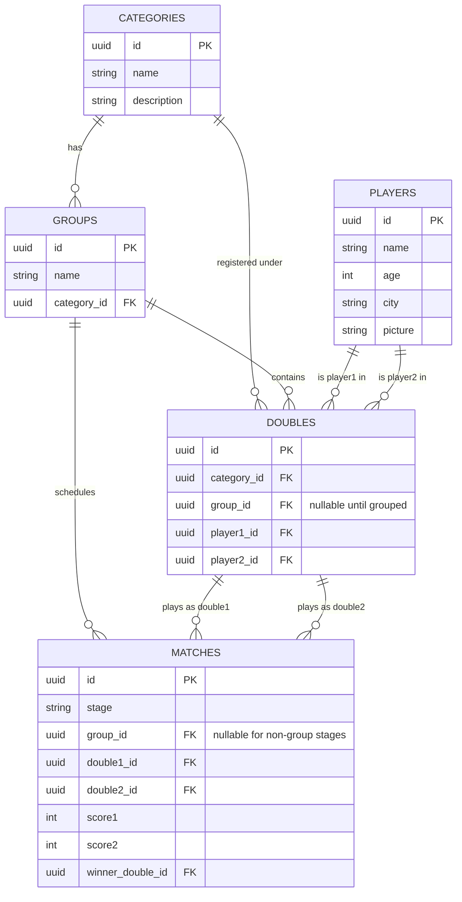

# Frontenis Tournament — Context Document

This document is meant to be handed to an AI assistant (or a new developer) as the single source of truth for this project. It covers the business rules, the current scope, the roles, and the full current database schema. No other conversation history is needed to understand the system from this file.

## 1. What the app does

A web app for organizing a frontenis tournament: registering players and doubles (pairs), organizing them into groups, tracking round-robin match results within those groups, and (in a future phase, not yet built) running a single-elimination knockout bracket among the group winners.

Stack: Next.js frontend, Supabase (Postgres + Auth + Storage) as the backend.

## 2. Tournament format

- **Three categories**, run independently of each other: **Free** (Libre — any age), **Masters** (players 50+), and **Female**.
- Within each category, the **group stage**: each group has N doubles (pairs of two players). Every double plays every other double in its group exactly once (round robin). A group of `k` doubles plays `k(k-1)/2` matches.
- **The top 2 doubles per group advance** to the next phase.
- **Ranking within a group**: primarily by number of wins; ties are broken by point differential (points scored minus points conceded) across all group-stage matches.
- **Not built yet**: the knockout (single-elimination) stage that follows the group stage. The schema has been shaped so this can be added later without a breaking migration (see §7).

## 3. Roles & permissions

- **User**: read-only. Can see categories, groups, doubles, and matches (with results).
- **Admin**: full write access. Registers players, registers doubles, triggers group/match creation, and enters match results.

Implemented via a Supabase `profiles` table (one row per `auth.users` row, holding a `role`) plus Postgres Row-Level Security: every table is readable by anyone, writable only when `profiles.role = 'admin'` for the current user.

## 4. Admin workflow (application logic — not all of this lives in the database)

1. **Register players**: name, age, city, and an optional picture. If a picture is uploaded, it goes to the `player-photos` bucket in Supabase Storage, and the resulting public URL is saved to `players.picture`. If no picture, the app shows a default avatar — that's a UI-only fallback, not a database default.
2. **Register doubles**: a pair of two players, registered under a specific category (`doubles.category_id`). At this point the double has **no group yet** (`doubles.group_id` is `null`) — grouping happens later, in bulk.
3. **Create groups**: once enough doubles are registered for a category, the admin picks that category, enters a group count, optionally picks one "head" double per group to seed, and triggers `create_groups_for_category(p_category_id, p_group_count, p_group_heads)` (a Postgres function, called via `supabase.rpc(...)`, not a sequence of client-side inserts — the whole operation runs as one transaction, so it either fully succeeds or fully fails with no broken half-state). It:
   - Rejects the call outright if `p_group_count` isn't a power of 2 (1, 2, 4, 8, 16...) — enforced in the database, not just the UI. Since exactly 2 doubles qualify per group, total qualifiers = 2 × (number of groups), which needs to land on a power of 2 for a clean knockout bracket later with no byes.
   - Refuses to run if groups already exist for that category (it's a one-time action per category — re-running it could duplicate groups or strand later-registered doubles).
   - Refuses to run if there aren't at least 2 ungrouped doubles per requested group.
   - Optionally seeds one "group head" per group first, via `p_group_heads` (an array of double IDs, one per group) — e.g. 8 groups → 8 seeded heads, one per group. Pass an empty array for pure-random group formation (the original behavior); if any heads are given, it must be exactly one per group. Validated: no duplicate heads, every head must be a real ungrouped double in that category.
   - Randomly shuffles whatever's still ungrouped (heads, if any, are already placed) and spreads them as evenly as possible across the groups (extra pairs land on the earlier groups, not all on one).
   - Generates the full round-robin set of `matches` for every group (every double vs. every other double in its group).
4. **Enter match results**: admin submits `score1` and `score2` for a match. The database automatically computes `winner_double_id` and `played_at` via a trigger — the admin never sets `winner_double_id` directly. A tied score is rejected by the database (frontenis has no draws). Clearing a score back to `null` also clears `winner_double_id`/`played_at` automatically, so a corrected match can never be left pointing at a stale result.
5. **Standings**: read from the `group_standings` view, which is already ordered by wins then point differential, with a `group_rank` column — `group_rank <= 2` is exactly "who advances."
6. **Who's still alive / eliminated**: read from the `double_status` view (built on `group_standings` + `group_progress`) — `status` is `'in_progress'`, `'advanced'`, or `'eliminated'`, always computed fresh, never stored.
7. **(Future, not built)**: the knockout bracket itself — pairing/seeding qualifiers into a round of N, tracking which match's winner feeds into which next match. The schema reserves a `matches.stage` column for this (see §7) but the bracket-building logic doesn't exist yet.

## 5. Entity-relationship diagram



## 6. Full database schema (Postgres / Supabase)

```sql
-- ============================================================================
-- Frontenis tournament — group stage schema
-- Target: Postgres 15+ / Supabase
-- ============================================================================

create extension if not exists "pgcrypto"; -- gives us gen_random_uuid()

-- ----------------------------------------------------------------------------
-- 1. Roles: profiles table extending Supabase auth.users
-- ----------------------------------------------------------------------------

-- Internal SECURITY DEFINER helpers live in a separate schema so PostgREST
-- never exposes them as public RPC endpoints (/rest/v1/rpc/<name>) — they're
-- only meant to be called by the trigger below or from inside RLS policies.
create schema if not exists private;
grant usage on schema private to anon, authenticated;

create type user_role as enum ('admin', 'user');

create table profiles (
  id         uuid primary key references auth.users(id) on delete cascade,
  role       user_role not null default 'user',
  created_at timestamptz not null default now()
);

-- Auto-create a profile (default role 'user') whenever someone signs up.
-- Promote someone to admin later with:
--   update profiles set role = 'admin' where id = '<user-uuid>';
create or replace function private.handle_new_user()
returns trigger
language plpgsql
security definer
set search_path = public
as $$
begin
  insert into public.profiles (id, role) values (new.id, 'user');
  return new;
end;
$$;

-- Nobody needs to call this directly — only the trigger fires it.
revoke execute on function private.handle_new_user() from public;

create trigger on_auth_user_created
  after insert on auth.users
  for each row execute procedure private.handle_new_user();

-- Helper used everywhere in RLS policies below.
create or replace function private.is_admin()
returns boolean
language sql
security definer
stable
set search_path = public
as $$
  select exists (
    select 1 from public.profiles where id = auth.uid() and role = 'admin'
  );
$$;

-- Policies below run as anon/authenticated, so they need EXECUTE — this is
-- what actually needs the function, not the general public via the API.
revoke execute on function private.is_admin() from public;
grant execute on function private.is_admin() to anon, authenticated;

-- ----------------------------------------------------------------------------
-- 2. Core tables
-- ----------------------------------------------------------------------------

create table categories (
  id          uuid primary key default gen_random_uuid(),
  name        text not null unique, -- e.g. 'Libre', 'Masters', 'Femenil'
  description text,
  created_at  timestamptz not null default now()
);

create table players (
  id         uuid primary key default gen_random_uuid(),
  name       text not null,
  age        integer check (age > 0 and age < 120),
  city       text,
  -- Public URL of the photo in the 'player-photos' Supabase Storage bucket
  -- (see section 6 below) — never store the image bytes in this column.
  picture    text,
  created_at timestamptz not null default now()
);

create table groups (
  id          uuid primary key default gen_random_uuid(),
  name        text not null, -- e.g. 'Grupo A'
  category_id uuid not null references categories(id) on delete cascade,
  created_at  timestamptz not null default now(),
  unique (category_id, name)
);

create index idx_groups_category on groups(category_id);

-- A "double" (pair) is registered under a category first; group_id stays
-- null until the admin runs "create groups" for that category.
create table doubles (
  id          uuid primary key default gen_random_uuid(),
  category_id uuid not null references categories(id) on delete cascade,
  group_id    uuid references groups(id) on delete set null,
  player1_id  uuid not null references players(id),
  player2_id  uuid not null references players(id),
  created_at  timestamptz not null default now(),
  constraint different_players     check (player1_id <> player2_id),
  -- canonical order so (A,B) and (B,A) can't both be inserted
  constraint canonical_player_order check (player1_id < player2_id),
  unique (player1_id, player2_id)
);

create index idx_doubles_category on doubles(category_id);
create index idx_doubles_group on doubles(group_id);
create index idx_doubles_player1 on doubles(player1_id);
create index idx_doubles_player2 on doubles(player2_id);

-- Once a double is assigned to a group, that group must belong to the same
-- category the double registered under.
create or replace function validate_double_group_category()
returns trigger
language plpgsql
set search_path = public
as $$
declare
  g_category uuid;
begin
  if new.group_id is not null then
    select category_id into g_category from groups where id = new.group_id;
    if g_category is distinct from new.category_id then
      raise exception 'doubles.group_id must belong to the same category as doubles.category_id';
    end if;
  end if;
  return new;
end;
$$;

create trigger trg_validate_double_group_category
  before insert or update on doubles
  for each row execute function validate_double_group_category();

-- A player can only ever be registered in one double for the whole
-- tournament (not just one per group) — this is what guarantees a player
-- can't compete in more than one category, since doubles.category_id is
-- fixed per double.
create or replace function validate_player_single_double()
returns trigger
language plpgsql
set search_path = public
as $$
begin
  if exists (
    select 1 from doubles
    where id <> coalesce(new.id, '00000000-0000-0000-0000-000000000000'::uuid)
      and (player1_id in (new.player1_id, new.player2_id)
        or player2_id in (new.player1_id, new.player2_id))
  ) then
    raise exception 'A player can only be registered in one pair for the entire tournament (one category)';
  end if;
  return new;
end;
$$;

create trigger trg_validate_player_single_double
  before insert or update on doubles
  for each row execute function validate_player_single_double();

-- Stage a match belongs to. Only 'group' is used for now — the rest are
-- here so the eventual knockout bracket doesn't require a matches migration.
create type match_stage as enum (
  'group', 'round_of_32', 'round_of_16', 'quarterfinal', 'semifinal', 'final'
);

-- A match is between two doubles: from the same group (group stage), or
-- from anywhere in the category (knockout stage, built later).
create table matches (
  id                uuid primary key default gen_random_uuid(),
  stage             match_stage not null default 'group',
  group_id          uuid references groups(id) on delete cascade,
  double1_id        uuid not null references doubles(id),
  double2_id        uuid not null references doubles(id),
  score1            integer check (score1 >= 0),
  score2            integer check (score2 >= 0),
  winner_double_id  uuid references doubles(id),
  played_at         timestamptz,
  created_at        timestamptz not null default now(),
  constraint different_doubles     check (double1_id <> double2_id),
  -- canonical order so (X,Y) and (Y,X) can't both be inserted
  constraint canonical_double_order check (double1_id < double2_id),
  constraint winner_is_participant  check (
    winner_double_id is null or winner_double_id in (double1_id, double2_id)
  ),
  -- group-stage matches must reference a group; knockout matches (built
  -- later, once the bracket exists) aren't tied to a single group
  constraint group_id_matches_stage check (
    (stage = 'group' and group_id is not null) or
    (stage <> 'group' and group_id is null)
  ),
  unique (double1_id, double2_id, stage)
);

create index idx_matches_group on matches(group_id);
create index idx_matches_double1 on matches(double1_id);
create index idx_matches_double2 on matches(double2_id);
create index idx_matches_stage on matches(stage);

-- For group-stage matches, both doubles must actually belong to the
-- match's group. Knockout matches (any other stage) skip this check.
create or replace function validate_match_group()
returns trigger
language plpgsql
set search_path = public
as $$
declare
  g1 uuid;
  g2 uuid;
begin
  if new.stage <> 'group' then
    return new;
  end if;
  select group_id into g1 from doubles where id = new.double1_id;
  select group_id into g2 from doubles where id = new.double2_id;
  if g1 is distinct from g2 then
    raise exception 'Both doubles in a match must belong to the same group';
  end if;
  if new.group_id is distinct from g1 then
    raise exception 'matches.group_id must match the doubles'' group_id';
  end if;
  return new;
end;
$$;

create trigger trg_validate_match_group
  before insert or update on matches
  for each row execute function validate_match_group();

-- Auto-derive the winner (and played_at) from the scores, so the admin only
-- ever has to submit score1 / score2 — this also answers the "not sure about
-- winner_double_id" question: it's a denormalized, auto-computed column that
-- exists purely to make standings/bracket queries cheap and simple.
create or replace function set_match_winner()
returns trigger
language plpgsql
set search_path = public
as $$
begin
  if new.score1 is not null and new.score2 is not null then
    if new.score1 = new.score2 then
      raise exception 'A frontenis match cannot end in a tie — check the scores';
    end if;
    new.winner_double_id := case when new.score1 > new.score2
                                  then new.double1_id else new.double2_id end;
    if new.played_at is null then
      new.played_at := now();
    end if;
  else
    -- a score got cleared (e.g. admin correcting a mistake) — don't leave
    -- a stale winner/played_at pointing at a result that no longer exists
    new.winner_double_id := null;
    new.played_at := null;
  end if;
  return new;
end;
$$;

create trigger trg_set_match_winner
  before insert or update on matches
  for each row execute function set_match_winner();

-- ----------------------------------------------------------------------------
-- 3. Group standings view (wins first, point differential as tiebreak)
-- ----------------------------------------------------------------------------

create or replace view group_standings
with (security_invoker = true) as
select
  d.group_id,
  d.id as double_id,
  count(*) filter (where m.winner_double_id = d.id)               as wins,
  count(*) filter (where m.winner_double_id is not null
                    and m.winner_double_id <> d.id)                as losses,
  coalesce(sum(
    case when m.double1_id = d.id then m.score1
         when m.double2_id = d.id then m.score2 end
  ), 0) as points_scored,
  coalesce(sum(
    case when m.double1_id = d.id then m.score2
         when m.double2_id = d.id then m.score1 end
  ), 0) as points_conceded,
  coalesce(sum(
    case when m.double1_id = d.id then m.score1 - m.score2
         when m.double2_id = d.id then m.score2 - m.score1 end
  ), 0) as point_differential,
  row_number() over (
    partition by d.group_id
    order by
      count(*) filter (where m.winner_double_id = d.id) desc,
      coalesce(sum(case when m.double1_id = d.id then m.score1 - m.score2
                         when m.double2_id = d.id then m.score2 - m.score1 end), 0) desc
  ) as group_rank
from doubles d
left join matches m
  on (m.double1_id = d.id or m.double2_id = d.id)
  and m.winner_double_id is not null
  and m.stage = 'group'
where d.group_id is not null
group by d.group_id, d.id;

-- group_rank <= 2 is exactly "the top two pairs that advance"

-- ----------------------------------------------------------------------------
-- 4. Row Level Security
--    Everyone (anon + authenticated) can read. Only admins can write.
-- ----------------------------------------------------------------------------

alter table categories enable row level security;
alter table groups      enable row level security;
alter table players     enable row level security;
alter table doubles     enable row level security;
alter table matches     enable row level security;
alter table profiles    enable row level security;

-- categories
create policy "categories_select_all" on categories for select using (true);
create policy "categories_write_admin" on categories for all
  using (private.is_admin()) with check (private.is_admin());

-- groups
create policy "groups_select_all" on groups for select using (true);
create policy "groups_write_admin" on groups for all
  using (private.is_admin()) with check (private.is_admin());

-- players
create policy "players_select_all" on players for select using (true);
create policy "players_write_admin" on players for all
  using (private.is_admin()) with check (private.is_admin());

-- doubles
create policy "doubles_select_all" on doubles for select using (true);
create policy "doubles_write_admin" on doubles for all
  using (private.is_admin()) with check (private.is_admin());

-- matches
create policy "matches_select_all" on matches for select using (true);
create policy "matches_write_admin" on matches for all
  using (private.is_admin()) with check (private.is_admin());

-- profiles: users can see their own row, admins can see everyone's
create policy "profiles_select_own_or_admin" on profiles for select
  using (id = auth.uid() or private.is_admin());
create policy "profiles_write_admin" on profiles for update
  using (private.is_admin()) with check (private.is_admin());

-- ----------------------------------------------------------------------------
-- 5. Optional seed data — adjust or remove
-- ----------------------------------------------------------------------------

-- insert into categories (name) values ('Libre'), ('Masters'), ('Femenil');

-- ----------------------------------------------------------------------------
-- 6. Player photo storage (Supabase Storage)
-- ----------------------------------------------------------------------------

insert into storage.buckets (id, name, public)
values ('player-photos', 'player-photos', true)
on conflict (id) do nothing;

-- No SELECT policy needed: the bucket is public, so object URLs work
-- without one. A broad SELECT policy here would let clients call the
-- Storage API's list endpoint and enumerate every file in the bucket,
-- which nothing in this app needs.

-- Only admins can upload/replace/delete photos.
create policy "player_photos_insert_admin"
on storage.objects for insert
with check (bucket_id = 'player-photos' and private.is_admin());

create policy "player_photos_update_admin"
on storage.objects for update
using (bucket_id = 'player-photos' and private.is_admin())
with check (bucket_id = 'player-photos' and private.is_admin());

create policy "player_photos_delete_admin"
on storage.objects for delete
using (bucket_id = 'player-photos' and private.is_admin());

-- App flow: admin uploads to the 'player-photos' bucket (e.g. path
-- `${player_id}.jpg`), then saves the resulting public URL into
-- players.picture.

-- ----------------------------------------------------------------------------
-- 7. Who's still alive / eliminated — derived, never stored
-- ----------------------------------------------------------------------------

-- Whether a group has finished every one of its round-robin matches yet.
-- (A double's placement isn't final — and it isn't "eliminated" — until
-- this is true; standings can still shift while matches remain.)
create or replace view group_progress
with (security_invoker = true) as
select
  g.id as group_id,
  count(distinct d.id) as pairs_in_group,
  (count(distinct d.id) * (count(distinct d.id) - 1)) / 2 as expected_matches,
  count(m.id) filter (where m.winner_double_id is not null) as played_matches,
  count(distinct d.id) >= 2
    and (count(distinct d.id) * (count(distinct d.id) - 1)) / 2
      = count(m.id) filter (where m.winner_double_id is not null)
    as group_stage_complete
from groups g
join doubles d on d.group_id = g.id
left join matches m
  on m.group_id = g.id and m.stage = 'group'
group by g.id;

-- Per-double status. Nothing here is stored — it's recomputed from
-- doubles/matches on every query, so a corrected score can never leave a
-- stale flag behind the way a stored is_eliminated column could.
--   'in_progress' — the group hasn't finished its round robin yet
--   'advanced'    — group is done and this double placed in the top 2
--   'eliminated'  — group is done and this double placed 3rd or lower
create or replace view double_status
with (security_invoker = true) as
select
  gs.double_id,
  gs.group_id,
  gs.wins,
  gs.losses,
  gs.points_scored,
  gs.points_conceded,
  gs.point_differential,
  gs.group_rank,
  gp.group_stage_complete,
  case
    when not gp.group_stage_complete then 'in_progress'
    when gs.group_rank <= 2 then 'advanced'
    else 'eliminated'
  end as status
from group_standings gs
join group_progress gp on gp.group_id = gs.group_id;

-- "Who's still in it" for a category:
--   select * from double_status where status in ('in_progress', 'advanced');
-- "Who's out":
--   select * from double_status where status = 'eliminated';

-- ----------------------------------------------------------------------------
-- 8. Group creation (admin action, one-time per category)
-- ----------------------------------------------------------------------------

-- Takes every currently-ungrouped double in a category, splits them into N
-- groups, and generates the full round-robin match set for each group.
-- Runs as one transaction: either everything lands, or nothing does.
--
-- Supports optional "group heads" (seeded doubles): pass one double per
-- group in p_group_heads to have it placed as that group's head before
-- the rest are randomly distributed — e.g. 8 groups → 8 seeded heads,
-- one per group, remaining doubles randomized. Pass an empty array (the
-- default) for pure-random group formation.
--
-- Deliberately SECURITY INVOKER (the default — no "security definer"
-- here): it runs as the calling user, so every insert/update inside it is
-- still checked against the normal RLS policies (which require
-- private.is_admin()). That means even if the app-layer admin check were
-- ever bypassed, a non-admin calling this directly would just get every
-- write inside it rejected by RLS — defense in depth, no special-casing
-- needed. Also why this one doesn't need to live in the `private` schema
-- like is_admin()/handle_new_user() do: being publicly callable via RPC
-- isn't a risk here, since RLS already makes it a no-op for non-admins.
create or replace function create_groups_for_category(
  p_category_id uuid,
  p_group_count integer,
  p_group_heads uuid[] default '{}'
)
returns void
language plpgsql
set search_path = public
as $$
declare
  v_double_count integer;
  v_head_count integer;
  v_invalid_heads integer;
begin
  -- group count must be a power of 2, or the knockout bracket built later
  -- won't divide cleanly
  if p_group_count is null or p_group_count < 1
     or (p_group_count & (p_group_count - 1)) <> 0 then
    raise exception 'Group count must be a power of 2 (1, 2, 4, 8, 16...), got %', p_group_count;
  end if;

  -- one-time action per category: once groups exist, re-running this
  -- would either duplicate groups or strand later-registered doubles
  -- outside the round-robin they'd need to be part of
  if exists (select 1 from groups where category_id = p_category_id) then
    raise exception 'Groups already exist for this category — group creation only runs once';
  end if;

  v_head_count := coalesce(array_length(p_group_heads, 1), 0);

  -- heads are optional: none means pure random (original behavior),
  -- otherwise it must be exactly one per group
  if v_head_count > 0 and v_head_count <> p_group_count then
    raise exception 'Provide one group head per group (%) or none at all — got %',
      p_group_count, v_head_count;
  end if;

  if v_head_count > 0 then
    if (select count(distinct h) from unnest(p_group_heads) as h) <> v_head_count then
      raise exception 'Group heads must all be different doubles';
    end if;

    select count(*) into v_invalid_heads
    from unnest(p_group_heads) as h
    where not exists (
      select 1 from doubles
      where id = h and category_id = p_category_id and group_id is null
    );
    if v_invalid_heads > 0 then
      raise exception 'One or more group heads are not valid, ungrouped doubles in this category';
    end if;
  end if;

  select count(*) into v_double_count
  from doubles
  where category_id = p_category_id and group_id is null;

  if v_double_count < p_group_count * 2 then
    raise exception
      'Not enough registered doubles (%) to fill % groups with at least 2 pairs each',
      v_double_count, p_group_count;
  end if;

  -- create the N groups
  insert into groups (category_id, name)
  select p_category_id, 'Grupo ' || n
  from generate_series(1, p_group_count) as n;

  -- seed the heads first, one per group — array position N (1-based)
  -- becomes the head of "Grupo N"
  if v_head_count > 0 then
    update doubles d
    set group_id = g.id
    from unnest(p_group_heads) with ordinality as head(double_id, idx)
    join groups g
      on g.category_id = p_category_id
     and g.name = 'Grupo ' || head.idx
    where d.id = head.double_id;
  end if;

  -- randomly shuffle whatever's still ungrouped (heads, if any, are
  -- already grouped and excluded here automatically), then spread evenly
  -- across the groups — the modulo mapping puts any extra pairs on the
  -- earlier groups rather than piling them all onto the last one
  with shuffled as (
    select id, row_number() over (order by random()) as rn
    from doubles
    where category_id = p_category_id and group_id is null
  ),
  assigned as (
    select s.id as double_id, g.id as group_id
    from shuffled s
    join groups g
      on g.category_id = p_category_id
     and g.name = 'Grupo ' || (((s.rn - 1) % p_group_count) + 1)
  )
  update doubles d
  set group_id = a.group_id
  from assigned a
  where d.id = a.double_id;

  -- generate every pairing within each new group exactly once, already
  -- in canonical order (d1.id < d2.id) so it satisfies the existing
  -- constraint without extra work
  insert into matches (group_id, double1_id, double2_id, stage)
  select d1.group_id, d1.id, d2.id, 'group'
  from doubles d1
  join doubles d2
    on d2.group_id = d1.group_id
   and d1.id < d2.id
  where d1.category_id = p_category_id
    and d1.group_id is not null;
end;
$$;

```

## 7. Key design decisions (quick reference)

- **`doubles.category_id` is set at registration; `doubles.group_id` stays null until grouping.** This is what makes step 3 of the admin workflow possible — doubles can exist before groups do. A trigger (`trg_validate_double_group_category`) ensures that once a double is assigned to a group, that group actually belongs to the double's category.
- **A player can only ever appear in one row of `doubles`, tournament-wide.** Enforced by `trg_validate_player_single_double`. Since a double is tied to exactly one category, this is what stops a player from competing in more than one category.
- **`winner_double_id` is auto-computed, not admin-entered.** A trigger (`trg_set_match_winner`) derives it from `score1`/`score2` and rejects ties. Clearing either score back to `null` clears `winner_double_id`/`played_at` too, so a corrected result never leaves a stale winner behind.
- **Canonical ordering** (`player1_id < player2_id`, `double1_id < double2_id`) plus `unique` constraints stop the same pair or fixture from being inserted twice under a different column order.
- **`matches.stage`** (`group`, `round_of_32`, `round_of_16`, `quarterfinal`, `semifinal`, `final`; default `'group'`) and a nullable `matches.group_id` were added now, ahead of the knockout stage being built, to avoid a schema migration later. A check constraint keeps them consistent: group-stage matches must have a `group_id`, every other stage must not. `group_standings` only counts `stage = 'group'` matches, so it isn't affected once knockout matches start being inserted.
- **`group_standings` is a view**, not a table — it's derived live from `doubles` and `matches`, always consistent, no sync logic needed. `group_rank` (via `row_number()`) makes "top 2 advance" a one-line filter. Ranks by wins, then `point_differential` (points scored minus points conceded) — not total points scored, which was the original rule but turned out to produce wrong rankings (a double with a high total but a worse differential could outrank one with a better differential).
- **`create_groups_for_category(p_category_id, p_group_count, p_group_heads)` is one atomic Postgres function**, not a sequence of client-side inserts — the create-N-groups / assign-doubles / generate-matches operation needs to succeed or fail as a whole, not leave a broken half-state if one part fails partway through. `p_group_heads` optionally seeds one double per group before the random shuffle runs (empty array = pure random, the original behavior). It's `SECURITY INVOKER` (the default), so its writes still go through normal RLS as the calling user — a non-admin calling it directly just gets every write inside it rejected by RLS, so unlike `is_admin()`/`handle_new_user()` it doesn't need to be hidden in the `private` schema.
- **Elimination status (`group_progress` + `double_status` views) is derived, not stored.** No `is_eliminated` column exists on `doubles` — a stored boolean could go stale the moment a score is corrected, and a double isn't actually eliminated until its whole group finishes its round robin, which a trigger would need to track separately anyway. `double_status.status` is computed fresh on every query instead.
- **Roles/RLS**: a `profiles` table (role: `admin` | `user`) + a `is_admin()` helper function used in every RLS policy. Every table: readable by anyone, writable only by admins. The `player-photos` Storage bucket uses the same pattern. Views use `security_invoker = true` so they respect the caller's RLS rather than the view owner's privileges.
- **`private.is_admin()` and `private.handle_new_user()` live outside `public`.** PostgREST auto-exposes every function in `public` as a callable API endpoint by default, and Postgres grants `EXECUTE` to everyone unless revoked. Neither function should be client-callable, so both live in a `private` schema (which PostgREST doesn't expose), with `EXECUTE` explicitly revoked from `public` and re-granted only to `anon`/`authenticated` on `is_admin()` (since RLS policies still need to invoke it as those roles).
- **Every function pins `search_path`**, closing off search-path injection (a role able to create objects in an earlier-resolving schema could otherwise shadow a table a function assumes it's querying).
- **No SELECT policy on `storage.objects` for `player-photos`.** The bucket is public, so object URLs work without one; adding a broad SELECT policy would let clients list/enumerate every file in the bucket instead of just fetching a known URL — an unnecessary capability this app doesn't use.
- **Player photos live in Supabase Storage**, not as bytes in Postgres — `players.picture` just stores the resulting public URL.

## 8. Current scope / what's NOT built yet

This schema and the workflow above cover **registration through the group stage, group creation, standings, and elimination status**. Explicitly out of scope for now, and not reflected anywhere except as a placeholder:

- The knockout/elimination bracket: seeding qualifiers, pairing them into rounds, and tracking which match's winner advances to which next match. `matches.stage` exists to support this later, but the bracket-building and progression logic itself hasn't been designed yet.
- The actual UI pages (public browsing views, admin dashboard forms) and the player-photo upload flow — the data layer (schema, server actions, the group-creation function) is built, but most of what's been built so far is that data layer, not the pages that use it.
